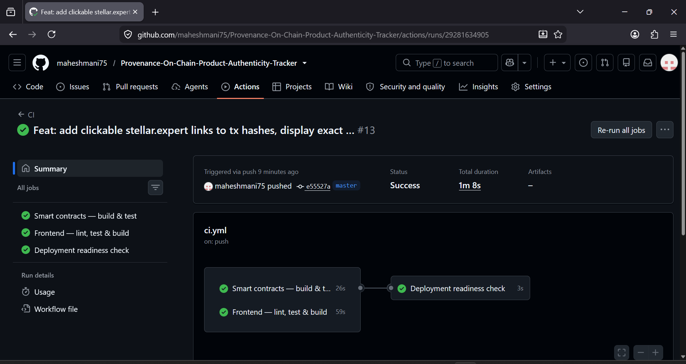

<div align="center">
  
# 📦 Provenance - On-Chain Product Authenticity Tracker

**A decentralized supply-chain tracking platform built on Stellar & Soroban smart contracts.**  
*Provenance completely prevents counterfeiting by enforcing a cryptographic chain of custody and an immutable on-chain transfer log.*

[](https://stellar.org/soroban)
[](https://vitejs.dev/)
[](https://provenance-on-chain-product-authent.vercel.app/)
[](https://drive.google.com/file/d/1KzASIszTKQEKD0brVDeMXUx-oAdIOYzE/view?usp=sharing)

### 🔗 [▶️ Live App](https://provenance-on-chain-product-authent.vercel.app/) &nbsp;|&nbsp; [🎥 Video Demo (1-2 min)](https://drive.google.com/file/d/1KzASIszTKQEKD0brVDeMXUx-oAdIOYzE/view?usp=sharing)

</div>

<br />

## 🌟 Key Features

1. **Unfakeable Provenance:** Manufacturers register products with unique serial numbers. The entire ownership handoff chain is recorded on the Stellar ledger, proving authenticity.
2. **Independent Witness Logs:** The current state (`ProductRegistry`) and the historical state (`TransferLog`) are decoupled. The history cannot be rewritten by current owners.
3. **Decentralized Flagging:** Any consumer can flag a suspected counterfeit, marking the product publicly and permanently.
4. **Instant Verification:** Consumers scan a generated QR code to verify the cryptographic chain of custody instantaneously.

---

## 🚀 Smart Contract Deployment (Stellar Testnet)

The smart contracts are live and deployed to the **Stellar Testnet** via automated CI/CD (GitHub Actions). 

| Contract | Contract ID | Explorer |
|---|---|---|
| 🏭 **ProductRegistry** | `CBVNSBPPH5GVHU4BDBJEFJ5QA5RM3D5HNK7EIHOP5GSFVL2FLVKTG6JF` | [View on Stellar Expert](https://stellar.expert/explorer/testnet/contract/CBVNSBPPH5GVHU4BDBJEFJ5QA5RM3D5HNK7EIHOP5GSFVL2FLVKTG6JF) |
| 📜 **TransferLog** | `CAMJID2OSE25IEQBE3DV3IDRSIALC65PF5KG52PWRGRUHMAY6AD6OTZP` | [View on Stellar Expert](https://stellar.expert/explorer/testnet/contract/CAMJID2OSE25IEQBE3DV3IDRSIALC65PF5KG52PWRGRUHMAY6AD6OTZP) |

### 🔗 Sample Contract Interaction (Transaction Hash)
- **Product Registration:** [eb1aa8158f3716ceb1deee9c5a584c14f8e326e049fb69ebf7658d680f1c0b99](https://stellar.expert/explorer/testnet/tx/eb1aa8158f3716ceb1deee9c5a584c14f8e326e049fb69ebf7658d680f1c0b99)
- **Custody Transfer:** [8e409274b78203a11aa34b437c824e1d2b3c227d8c914d859b5f77132769ce13](https://stellar.expert/explorer/testnet/tx/8e409274b78203a11aa34b437c824e1d2b3c227d8c914d859b5f77132769ce13)

---

## ✅ Submission Requirements Checklist

### 1. Mobile Responsive UI
Our frontend is built mobile-first using Tailwind CSS, ensuring smooth QR scanning and verification on any device.


### 2. Product UI & Web Experience


### 3. CI/CD Pipeline Running (GitHub Actions)
Our GitHub Actions pipeline automatically builds WASM contracts, lints the frontend, and runs test suites.


### 4. Test Output with Passing Tests
We have 12+ smart contract unit tests and frontend Vitest suites ensuring stability.


---

## 🛠️ Project Architecture

```text
Manufacturer / Supply chain party          Consumer
        │                                     │
        ▼                                     ▼
         React frontend (QR scan/generate, verification seal, live feed)
                          │
                          ▼
              ProductRegistry contract ──────► TransferLog contract
              (register, transfer, flag)        (append-only custody history)
```

**Inter-contract communication**: the Registry contract calls into `TransferLog` on every `transfer_custody` call, via `record_transfer`. The TransferLog requires `registry.require_auth()`, ensuring only the authorized Registry instance can append to a product's history. 

---

## 💻 Running Locally

### 1. Contracts
```bash
# Requires Rust + wasm32-unknown-unknown target + Stellar CLI
rustup target add wasm32-unknown-unknown
cargo install --locked stellar-cli

# Run all contract tests
cargo test --workspace          
# Build .wasm files
stellar contract build           
```

### 2. Frontend
```bash
cd frontend
npm install
npm run dev       # local dev server
npm run test      # Vitest unit tests
npm run build     # production build
```

---

## 📄 License
This project is licensed under the MIT License.
